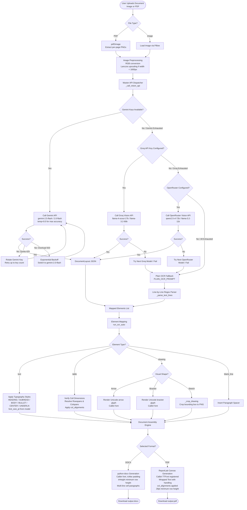

<div align="center">

# Docify AI

**High-fidelity handwriting-to-document conversion powered by Google Gemini and multi-provider vision models**

[](https://www.python.org/)
[](https://fastapi.tiangolo.com/)
[](https://ai.google.dev/)
[](https://groq.com/)
[](https://openrouter.ai/)
[](https://www.reportlab.com/)
[](https://python-docx.readthedocs.io/)
[](https://github.com/psf/black)
[](#installation-guide)
[](LICENSE)

Docify AI converts scanned handwritten notes, photographic records, and multi-page PDF files into highly structured, fully editable Microsoft Word (.docx) and PDF (.pdf) documents. By executing layout analysis and OCR inside unified multimodal visual prompts, the application reproduces paragraph styles, font hierarchies, mathematical equations, data tables, and inline drawing sketches with optimal structural preservation.

</div>

---

## Table of Contents

- [What's New](#whats-new)
- [System Architecture](#system-architecture)
- [Core Capabilities](#core-capabilities)
- [Multi-Provider Resilience Framework](#multi-provider-resilience-framework)
- [Image Preprocessing and OCR Caching](#image-preprocessing-and-ocr-caching)
- [Pydantic Layout Schema](#pydantic-layout-schema)
- [Element Mapping and Output Assembly](#element-mapping-and-output-assembly)
- [PDF and DOCX Parity](#pdf-and-docx-parity)
- [Technology Stack](#technology-stack)
- [Directory Structure](#directory-structure)
- [Installation Guide](#installation-guide)
  - [Prerequisites](#prerequisites)
  - [Installing Poppler](#installing-poppler)
  - [Step-by-Step Installation](#step-by-step-installation)
- [Running the Application](#running-the-application)
- [Web Interface Reference](#web-interface-reference)
- [API Reference](#api-reference)
  - [POST /convert](#post-convert)
- [Configuration Reference](#configuration-reference)
- [License](#license)

---

## What's New

### v2.0 — Accuracy & Parity Update

| Area | Improvement |
| :--- | :--- |
| **Unicode PDF Font** | PDF now uses **Calibri** (same as DOCX) via ReportLab TTFont registration — Greek letters, math symbols, arrows, subscripts all render correctly |
| **Math & Equations** | Overhauled OCR prompt explicitly instructs Gemini to transcribe superscripts (`^`), subscripts (`_`), fractions, Greek letters (α β γ Σ …), √ roots, vectors, and matrices |
| **Table Row Spacing** | Table rows now have a minimum height of **28 pt** with **8–10 pt top/bottom cell padding** — matching the visual line spacing of original notebook pages |
| **DOCX Multi-line Cells** | Table cells containing `\n` now render each line as a separate Word paragraph with correct spacing and alignment |
| **Column Alignment** | Gemini now outputs per-column alignment (`col_alignments`), applied to both PDF and DOCX table cells |
| **Font Size Detection** | Gemini estimates `font_size_pt` per element (16 heading / 13 subhead / 12 body / 10 footnote) — applied in both outputs |
| **OCR Temperature** | API temperature set to `0.0` for fully deterministic, maximum-accuracy transcription |
| **PDF Newline Fix** | ReportLab `drawString` no longer receives raw `\n` characters — all text is pre-split into line segments before drawing |
| **Cell Padding (DOCX)** | Added `tcMar` XML cell margins (6 pt all sides) and `trHeight` minimum row height to DOCX tables |
| **PDF/DOCX Parity** | PDF and DOCX now use the same font, same font sizes, same column alignment, same row spacing |

---

## System Architecture

The following diagram illustrates the lifecycle of a document processing request from file upload to final artifact download, highlighting the pre-processing steps, API provider failover tree, elements assembly, and format rendering.



---

## Core Capabilities

- **Unified Layout Analysis**: Document layout mapping and handwriting transcription are completed in a single multimodal request, avoiding multiple passes and reducing token fees.
- **Dynamic Hierarchy Construction**: The model assigns structural tags (HEADING, SUBHEAD, BODY, BULLET, CENTER, UNDERLN) and calculates typographical margins, font scaling, alignments, and spacings.
- **Refined Text Styling**: Stroke weight, slant, and underline patterns are analyzed at the character run level, applying bold, italic, and underline settings onto the default styles.
- **Math & Equation Support**: Superscripts, subscripts, fractions, Greek letters, radical signs, vectors, and matrices are transcribed using Unicode characters — rendered correctly in both PDF and DOCX.
- **Structural Table Recreation**: Extracts borderless and grid tables, dynamically merging cell matrices using rowspan/colspan attributes. Per-column alignment is detected and applied in both formats.
- **Notebook Row Spacing**: Tables from handwritten sources use minimum row heights and generous cell padding to match the visual line spacing of the original document.
- **Embedded Sketch Cropping**: Bounding coordinates for sketches, charts, and signatures are cropped out of the original high-resolution inputs and re-embedded inline in their correct reading order.
- **Arrow and Bracket Mapping**: Maps simple hand-drawn arrow vectors and enclosing braces directly into scalable Unicode symbols, reducing output file size.
- **Layout Customization and Overrides**: Provides toggle controls between auto-layout detection and manual typography overrides (font size, style, margins, alignment) via the web client.

---

## Multi-Provider Resilience Framework

To ensure high availability under resource limits and API rate constraints, Docify AI implements a multi-provider fallback hierarchy:

1. **Gemini API (Primary)**:
   - Utilizes `gemini-2.5-flash` for high-speed structured JSON generation using schema validation.
   - API temperature is set to `0.0` for fully deterministic, maximum-accuracy OCR output.
   - Implements **API Key Rotation**: Accepts a comma-separated list of keys in `GEMINI_API_KEY` and switches to the next key on 429 quota exhaustion.
   - Implements **Model Failover**: Falls back to `gemini-2.0-flash` on prolonged 503 service unavailability.
   - Retries failed requests up to 4 times with exponential backoff delays (4s, 8s, 16s, 32s).

2. **Groq API (First Fallback)**:
   - Triggered automatically if all Gemini keys/models fail or are unconfigured.
   - Interrogates vision models in sequence:
     - `meta-llama/llama-4-scout-17b-16e-instruct`
     - `meta-llama/llama-4-maverick-17b-128e-instruct`
     - `llama-3.2-90b-vision-preview`
     - `llama-3.2-11b-vision-preview`
   - Dynamically injects Pydantic schema requirements as JSON instructions for models that do not natively support structured outputs.

3. **OpenRouter API (Second Fallback)**:
   - Active if Groq and Gemini fail or are unconfigured.
   - Rotates through free high-capacity vision models:
     - `qwen/qwen2.5-vl-72b-instruct:free`
     - `qwen/qwen2-vl-7b-instruct:free`
     - `meta-llama/llama-3.2-11b-vision-instruct:free`
     - `google/gemini-2.0-flash-exp:free`

4. **Plain OCR and RegEx Fallback**:
   - If structured output calls fail across all APIs, Docify AI requests unstructured, line-by-line transcription.
   - The backend processes the output using regular expressions and prefix mapping (`_parse_text_lines`) to build a clean text layout.

---

## Image Preprocessing and OCR Caching

### Image Preprocessing
Before submission to the vision models, images are processed using standard Pillow transformations:
- **RGB Normalization**: Converts input color spaces (RGBA, CMYK, Palette, Grayscale) into standardized three-channel RGB color values.
- **Lanczos Upscaling**: Small images (width under 1600px) are scaled up using Lanczos filters to make handwritten text clearer for the models.
- **Filter Avoidance**: The engine avoids aggressive sharpening or thresholding to preserve the visual context needed for multimodal comprehension.

### Server-Side OCR Caching
To reduce API overhead and accelerate response times, Docify AI runs a file-hash caching database:
- Computes an MD5 checksum of the processed image file.
- Saves the extracted OCR layout and metadata in JSON format as `uploads/ocr_cache_[MD5_HASH].json`.
- Subsequent conversions of the same document load the parsed structure from the local cache instantly.

---

## Pydantic Layout Schema

Gemini responses are validated against a strict Pydantic model configuration:

```python
class DocElement(BaseModel):
    type: str               # 'text', 'blank_line', 'table', 'drawing'
    text: Optional[str]     # Transcribed text content
    tag: Optional[str]      # 'HEADING', 'SUBHEAD', 'BODY', 'BULLET', 'CENTER', 'UNDERLN'
    bold: Optional[bool]
    italic: Optional[bool]
    underline: Optional[bool]
    alignment: Optional[str]        # 'left', 'center', 'right', 'justify'
    left_indent_cm: Optional[float]
    font_size_pt: Optional[float]   # Model-estimated font size (16/13/12/10 pt)
    space_before_pt: Optional[float]
    space_after_pt: Optional[float]

    # Table fields
    table_data: Optional[List[List[str]]]   # Rows × columns of cell text
    borderless: Optional[bool]              # True for layout grids
    col_alignments: Optional[List[str]]     # Per-column alignment: ['center','left','left',...]

    # Drawing fields
    bbox: Optional[List[float]]         # Normalized [x1, y1, x2, y2]
    description: Optional[str]
    is_simple_arrow: Optional[bool]
    arrow_direction: Optional[str]      # 'right', 'left', 'up', 'down', etc.
    is_simple_bracket: Optional[bool]
    bracket_style: Optional[str]        # 'curly', 'square', 'plain'
    bracket_side: Optional[str]         # 'left', 'right'

class DocumentLayout(BaseModel):
    page_margin_cm: float = 2.54
    line_spacing: float = 1.15
    elements: List[DocElement]
```

---

## Element Mapping and Output Assembly

The table below outlines the default formatting rules used by the mapping controller when translating layout tags into document outputs:

| Layout Tag | Base Weight | Slant | Font Size | Paragraph Alignment | Left Indent | Space Before | Space After |
| :--- | :---: | :---: | :---: | :--- | :---: | :---: | :---: |
| `HEADING` | Bold | Normal | 16 pt | Left | 0.0 cm | 12 pt | 6 pt |
| `SUBHEAD` | Bold | Normal | 13 pt | Left | 0.0 cm | 8 pt | 4 pt |
| `BODY` | Normal | Normal | 12 pt | Left | 0.0 cm | 0 pt | 3 pt |
| `BULLET` | Normal | Normal | 12 pt | Left | 0.5 cm | 0 pt | 3 pt |
| `CENTER` | Normal | Normal | 12 pt | Center | 0.0 cm | 4 pt | 4 pt |
| `UNDERLN` | Normal | Normal | 12 pt | Left | 0.0 cm | 0 pt | 3 pt |
| `TABLE` (>5 rows) | Mixed | Normal | 9.5 pt | Per-column | — | — | — |
| `TABLE` (≤5 rows) | Mixed | Normal | 11 pt | Per-column | — | — | — |

### Custom Processing Logic
- **Signature Blocks**: Uses borderless tables with empty headers to place side-by-side signature components next to each other.
- **Dynamic Text Shrinkage**: Footer notes and metadata blocks are scaled down to 8.5 pt and 9.5 pt dynamically to match professional layouts.
- **Multi-line Table Cells**: Cell content containing `\n` is split into separate paragraphs/lines — works in both DOCX and PDF.
- **Double Space Cleanup**: Cleans up multiple spaces and converts them to non-breaking spaces (`\xA0`) to keep formatting aligned.

---

## PDF and DOCX Parity

Docify AI is engineered so that the PDF and DOCX outputs are visually identical. Here's how parity is achieved:

### Font: Calibri in PDF (Unicode TTF)

ReportLab's built-in fonts (Helvetica, Times-Roman) only support Latin-1 characters. Docify AI registers **Calibri** as a Unicode TTF font in ReportLab at startup:

```python
from reportlab.pdfbase.ttfonts import TTFont
pdfmetrics.registerFont(TTFont("Calibri",      r"C:\Windows\Fonts\calibri.ttf"))
pdfmetrics.registerFont(TTFont("Calibri-Bold", r"C:\Windows\Fonts\calibrib.ttf"))
# ... italic, bolditalic variants
```

This enables correct rendering of:
- Greek letters: α β γ δ Σ Π θ λ μ ω
- Math symbols: √ ∑ ∫ ∂ ≈ ≠ ≤ ≥ × ÷
- Superscripts / subscripts: x² H₂O
- Arrows and special punctuation: → ← ↑ ↓ ⟶

Falls back to Arial if Calibri is unavailable, then Helvetica.

### Table Row Spacing Parity

| Setting | DOCX | PDF |
| :--- | :--- | :--- |
| Minimum row height | 0.85 cm (`trHeight`) | 28 pt (`MIN_ROW_H`) |
| Cell top/bottom padding | 6 pt (`tcMar`) | 8–10 pt (`pad_y`) |
| Cell left/right padding | 6 pt (`tcMar`) | 4–5 pt (`pad_x`) |
| Font size (dense tables) | 9.5 pt | 9.5 pt |
| Font size (small tables) | 11 pt | 11 pt |

### Column Alignment Parity

Both DOCX and PDF read `col_alignments` from the Gemini OCR output and apply per-column text alignment:

```
col_alignments: ["center", "left", "left"]
```

- Column 0 → center-aligned (e.g., header or index column)
- Columns 1, 2 → left-aligned

---

## Technology Stack

| Layer | Dependency | Version | Purpose |
| :--- | :--- | :--- | :--- |
| **API & Routing** | FastAPI | 0.110.0+ | Server framework and REST API endpoints |
| **ASGI Engine** | Uvicorn | 0.28.0+ | Server runner and hot-reloader |
| **Vision AI** | google-genai | 0.1.0+ | Gemini models SDK connection |
| **Failover Models** | groq / openai | 0.5.0+ / 1.12.0+ | Fallback integration for secondary engines |
| **PDF Extraction** | pypdfium2 | 4.28.0+ | Multi-page PDF layout splitter |
| **Image Processing** | Pillow (PIL) | 10.2.0+ | Image sizing, formats, and canvas rendering |
| **Word Generator** | python-docx | 1.1.0+ | Native XML Word layout builder |
| **PDF Generator** | ReportLab | 4.1.0+ | Custom coordinates vector canvas generator |
| **PDF Unicode Font** | TTFont (ReportLab) | Built-in | Calibri/Arial TTF font registration for Unicode |
| **Data Validation** | Pydantic v2 | 2.6.0+ | JSON layout validation |
| **Configuration** | python-dotenv | 1.0.0+ | Environment variables loader |
| **Frontend UI** | HTML5 / CSS3 / JS | Native | Modern dark/light responsive interface |

---

## Directory Structure

```
docify/
├── main.py                  # Core backend app: handles routing, vision, document generation
├── run.bat                  # Windows runner script
├── requirements.txt         # Project package dependencies
├── .env                     # Configuration keys (excluded from source control)
├── .gitignore               # Ignored files configuration
├── static/                  # Shared client assets
│   ├── css/
│   │   ├── styles.css       # Main application styling (dark/light mode variables)
│   │   └── landing.css      # Landing presentation style sheet
│   └── js/
│       ├── main.js          # Core interface logic: upload flow and parameter mapping
│       ├── landing.js       # Animations and navigation for landing page
│       ├── about.js         # Technical informational display operations
│       ├── history.js       # client-side conversion history management
│       ├── login.js         # Authorization layout functions
│       └── theme.js         # Dynamic dark/light color scheme toggle controller
├── templates/               # Server-side HTML render layouts
│   ├── landing.html         # Front landing portal
│   ├── index.html           # Core converter system page
│   ├── about.html           # Developer about info page
│   ├── history.html         # Saved conversion record logs page
│   └── login.html           # Authentication portal page
├── uploads/                 # Storage for source files and cropped sketches (ignored)
└── outputs/                 # Storage for generated word/pdf download packages (ignored)
```

---

## Installation Guide

### Prerequisites
- Python 3.9 or higher.
- `pip` package manager.
- **Poppler** utility binaries (required by `pdf2image` to extract pages from PDF files).
- An API Key from [Google AI Studio](https://aistudio.google.com/).
- Optional: Groq or OpenRouter API credentials for failover configurations.

---

### Installing Poppler

#### Windows
1. Download the latest pre-compiled binary package from [Poppler for Windows](https://github.com/oschwartz10612/poppler-windows/releases/).
2. Extract the directory contents to an accessible path (e.g., `C:\poppler`).
3. Add the path to the extracted `bin` folder (e.g., `C:\poppler\Library\bin` or `C:\poppler\bin`) to your system **Path** environment variable:
   - Search for **Environment Variables** in the Windows taskbar.
   - Under System Variables, click **Path** and select Edit.
   - Click New and enter the path to the Poppler `bin` directory.
   - Click OK to save the changes.
4. Restart your terminal application to apply the new path settings.

#### macOS
Install poppler using the Homebrew package manager:
```bash
brew install poppler
```

#### Linux
Install poppler using your distribution's package manager:
```bash
# Ubuntu / Debian
sudo apt-get update
sudo apt-get install -y poppler-utils

# Fedora / CentOS
sudo dnf install poppler-utils
```

---

### Step-by-Step Installation

1. **Clone the repository**:
   ```bash
   git clone https://github.com/meetchauhan17/docify.git
   cd docify
   ```

2. **Establish a Python virtual environment**:
   ```bash
   python -m venv venv
   ```

3. **Activate the environment**:
   - **Windows (PowerShell)**:
     ```powershell
     .\venv\Scripts\Activate.ps1
     ```
   - **Windows (CMD)**:
     ```cmd
     .\venv\Scripts\activate.bat
     ```
   - **macOS / Linux**:
     ```bash
     source venv/bin/activate
     ```

4. **Install Python dependencies**:
   ```bash
   pip install -r requirements.txt
   ```

5. **Configure environment settings**:
   Create a `.env` file in the project root:
   ```env
   # API Keys configuration (comma-separated for key rotation on Gemini)
   GEMINI_API_KEY=key_one,key_two
   
   # Optional Fallback API Keys
   GROQ_API_KEY=your_groq_api_key_here
   OPENROUTER_API_KEY=your_openrouter_api_key_here
   ```

6. **Initialize folders**:
   ```bash
   mkdir uploads
   mkdir outputs
   ```

---

## Running the Application

### Option A: Windows Launcher
Run the setup batch file:
```cmd
run.bat
```

### Option B: Manual CLI Run
Start the Uvicorn ASGI server:
```bash
uvicorn main:app --reload --port 8000
```
Open a web browser and navigate to `http://localhost:8000`.

---

## Web Interface Reference

Docify AI exposes a multi-page web application served by FastAPI with Jinja2 templating:

| Route Path | View Interface | Technical Role |
| :--- | :--- | :--- |
| `/` | Landing page | Project overview, interactive features overview, and system portal access. |
| `/convert` | Converter page | Main interface for file upload, format selector, auto/manual toggles, and processing triggers. |
| `/history` | History page | Lists previous conversion records loaded client-side via browser `localStorage`. |
| `/about` | Technical Information | Full technical walkthrough outlining elements parsing rules and configuration info. |
| `/login` | Authentication page | Login portal structure for user verification systems. |

---

## API Reference

### POST /convert

Submits a document file to be parsed and downloads the formatted output.

- **Content-Type**: `multipart/form-data`

#### Request Parameters

| Parameter | Data Type | Required | Default Value | Functional Role |
| :--- | :--- | :---: | :--- | :--- |
| `file` | Binary | Yes | - | Source file upload (`PNG`, `JPG`, `JPEG`, `WEBP`, or `PDF`). |
| `outtype` | String | No | `docx` | Target export format: `docx` or `pdf`. |
| `mode` | String | No | `preserve` | Text structure layout: `preserve` respects original lines; `flow` combines paragraphs. |
| `auto_format` | String | No | `true` | When `true`, uses AI layout extraction. When `false`, uses the manual overrides below. |
| `font_family` | String | No | `Calibri` | Manual override font family (e.g. `Arial`, `Times New Roman`, `Georgia`). |
| `font_size` | Float | No | `12.0` | Manual override font size in points. |
| `line_spacing` | Float | No | `1.15` | Manual override line spacing multiplier: `1.0`, `1.15`, `1.5`, `2.0`. |
| `para_spacing` | Float | No | `8.0` | Manual override space after paragraphs in points. |
| `first_line_indent` | Float | No | `0.0` | Manual override first line indent in centimeters. |
| `page_margin` | Float | No | `2.54` | Manual override page margin in centimeters. |
| `text_align` | String | No | `left` | Manual override text alignment: `left`, `center`, `right`, `justify`. |
| `text_bold` | String | No | `false` | Manual override: forces all text to bold (`true`/`false`). |
| `text_italic` | String | No | `false` | Manual override: forces all text to italic (`true`/`false`). |
| `text_underline` | String | No | `false` | Manual override: forces all text to underline (`true`/`false`). |

#### Example Client Submissions

##### cURL command:
```bash
curl -X POST http://localhost:8000/convert \
  -F "file=@handwritten_sheet.jpg" \
  -F "outtype=docx" \
  -F "auto_format=true" \
  --output document_result.docx
```

##### Python script:
```python
import requests

url = "http://localhost:8000/convert"
files = {"file": open("handwritten_sheet.jpg", "rb")}
data = {
    "outtype": "pdf",
    "auto_format": "true",
    "mode": "preserve"
}

response = requests.post(url, files=files, data=data)

if response.status_code == 200:
    with open("document_result.pdf", "wb") as f:
        f.write(response.content)
    print("Document compiled successfully.")
else:
    print(f"Error: {response.json()}")
```

---

## Configuration Reference

Docify AI loads its primary runtime values from the system environment or your local `.env` file:

| Environment Variable | Required | Description                                            |
| :---------------------| :--------:| :-------------------------------------------------------|
| `GEMINI_API_KEY`     | Yes      | Comma-separated list of Google Gemini API keys.        |
| `GROQ_API_KEY`       | No       | API Key for backup Llama vision models from Groq.      |
| `OPENROUTER_API_KEY` | No       | API Key for backup free vision models from OpenRouter. |

### Internal System Constants
These variables can be adjusted directly in `main.py` if needed:

| Constant | Default Value | Description |
| :--- | :--- | :--- |
| `_PRIMARY_MODEL` | `gemini-2.5-flash` | The primary vision model for processing OCR structured layout JSON. |
| `_FALLBACK_MODEL` | `gemini-2.0-flash` | Backup Gemini model tried when the primary returns a 503 error. |
| `UPLOAD_DIR` | `"uploads"` | Folder used to store uploaded files and cropped drawing assets. |
| `OUTPUT_DIR` | `"outputs"` | Folder where generated Word and PDF files are saved. |
| `TIMEOUT` | `120,000 ms` | Maximum time allowed per vision API call before timeout. |
| `API_TEMPERATURE` | `0.0` | OCR generation temperature — 0.0 = fully deterministic, max accuracy. |

---

## License

This project is licensed under the terms of the MIT License. See the [LICENSE](LICENSE) file for complete details.
