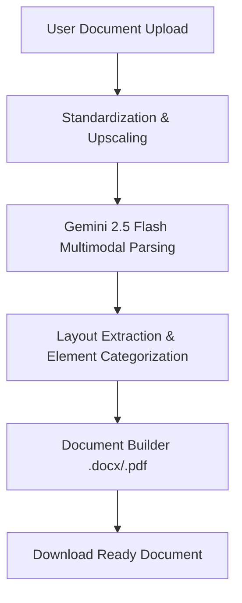

# Docify AI

An intelligent handwriting-to-document converter that transforms scanned notes, images, and multi-page PDFs into structured, editable Microsoft Word (.docx) and PDF files while preserving the original layout, alignment, formatting, and inline hand-drawn diagrams.

[](https://www.python.org/)
[](https://fastapi.tiangolo.com/)
[](https://ai.google.dev/)
[](LICENSE)

---

## Table of Contents

- [Overview](#overview)
- [Key Features](#key-features)
- [System Architecture](#system-architecture)
- [Installation Guide](#installation-guide)
  - [Prerequisites](#prerequisites)
  - [Step-by-Step Setup](#step-by-step-setup)
- [Running the Application](#running-the-application)
- [API Reference](#api-reference)
- [Development and Preprocessing](#development-and-preprocessing)
- [License](#license)

---

## Overview

Docify AI bridges the gap between physical handwriting and digital document workflows. Unlike traditional OCR software that dumps raw, unformatted text, Docify AI analyzes the visual hierarchy and layout of the handwritten document. 

By leveraging Google's Gemini 2.5 Flash model and a structured multimodal parsing pipeline, Docify AI reconstructs the document's original structure. It replicates headings, lists, tables, centered text, underlines, and inline sketches directly in the generated output files.

---

## Key Features

- **Auto-Detect Formatting**: Automatically extracts font size weight, text alignment, margins, first-line indent, and text decorations like bold, italic, and underline from the handwriting image.
- **Consolidated Processing Pipeline**: Integrates text transcription and layout analysis into a single multimodal API request, reducing API latency and token consumption by 50%.
- **Native Table Reconstruction**: Detects hand-drawn tables and builds them as editable tables in Word and aligned grid boxes in PDF.
- **Drawing and Diagram Preservation**: Automatically locates diagrams, flowcharts, or sketches, crops them from the source image, and embeds them inline within the document flow to ensure zero text-image overlapping.
- **Unicode Element Mapping**: Recognizes simple shapes like hand-drawn arrows and brackets, converting them directly to Segoe UI Symbol unicode characters instead of image files where applicable.
- **Manual Overrides**: Offers a manual formatting panel to choose standard font styles, uniform spacing, alignment, and page margins for cleaner, standardized output.

---

## System Architecture

Docify AI processes documents through a highly optimized four-stage conversion pipeline:



### 1. Preprocessing and Standardization
The uploaded image or PDF is converted to RGB format. Small images (under 1600 pixels wide) are upscaled to ensure the Gemini vision encoder can read small details. No destructive filters or binary thresholds are applied, maintaining the natural shades for the vision model.

### 2. Consolidated Multimodal Parsing
A single API request is sent containing the image and the combined prompt instructions. The SDK is configured with a Pydantic schema target (`DocumentLayout`), which guarantees a structured JSON output containing:
- Document-level settings (margins, line spacing).
- A flat list of document elements (text, tables, drawings, blank lines) sorted in their exact top-to-bottom reading order.

### 3. Native File Generation
The Python backend iterates through the structured layout elements:
- **Text Elements**: Rendered with customized paragraph formatting, spacing, margins, bold/italic markers, and underlines using `python-docx` or `reportlab`.
- **Tables**: Built using native Word grid components or ReportLab canvas rectangles.
- **Drawings**: Extracted using the coordinate bounding box and saved as crops, then added inline at their exact text-flow position.

---

## Installation Guide

### Prerequisites

- Python 3.9 or higher
- Pip package manager
- Poppler (required by `pdf2image` for PDF processing)
  - Windows: Download Poppler for Windows and add the `bin` directory to the system PATH.
  - Linux: Run `sudo apt-get install poppler-utils`

### Step-by-Step Setup

1. **Clone the Repository**:
   ```bash
   git clone https://github.com/meetchauhan17/docify.git
   cd docify
   ```

2. **Create a Virtual Environment**:
   ```bash
   python -m venv venv
   ```

3. **Activate the Virtual Environment**:
   - Windows (PowerShell):
     ```powershell
     .\venv\Scripts\Activate.ps1
     ```
   - Windows (Command Prompt):
     ```cmd
     .\venv\Scripts\activate.bat
     ```
   - Linux/macOS:
     ```bash
     source venv/bin/activate
     ```

4. **Install Dependencies**:
   ```bash
   pip install -r requirements.txt
   ```
   *Note: Ensure python-docx, reportlab, fastapi, uvicorn, pdf2image, pillow, and google-genai are installed.*

5. **Configure Environment Variables**:
   Create a `.env` file in the root directory and add your Google Gemini API key:
   ```env
   GEMINI_API_KEY=your_gemini_api_key_here
   ```

---

## Running the Application

To start the FastAPI server locally, run the provided batch script or execute uvicorn directly:

- **Using the batch script (Windows)**:
  ```bash
  run.bat
  ```

- **Using Uvicorn**:
  ```bash
  uvicorn main:app --reload --port 8000
  ```

Once started, open your browser and navigate to:
```
http://localhost:8000
```

---

## API Reference

### Convert Document

- **Endpoint**: `/convert`
- **Method**: `POST`
- **Content-Type**: `multipart/form-data`

#### Parameters

| Field | Type | Description |
| :--- | :--- | :--- |
| `file` | File | The source image (PNG, JPG) or PDF file. |
| `mode` | String | Page flow mode: `preserve` (maintains line breaks) or `flow` (continuous paragraphs). |
| `outtype` | String | The output file type: `docx` or `pdf`. |
| `auto_format` | String | Set to `true` to enable layout replication or `false` for manual overrides. |
| `font_family` | String | Manual override font family (e.g. Calibri, Arial). |
| `font_size` | Float | Manual override font size in points. |
| `line_spacing` | Float | Manual override line spacing multiplier. |
| `page_margin` | Float | Manual override page margin in centimeters. |

---

## Development and Preprocessing

If you want to customize the parsing behavior, you can edit the models and prompts directly in `main.py`:
- **DocumentLayout & DocElement Schema**: Defined at the top of `main.py`. Any changes to these Pydantic classes will update the Gemini structured JSON validation target.
- **COMBINED_OCR_PROMPT**: Found in `main.py`. This contains the layout rules, mathematical formatting directives, and transcription guidelines sent to Gemini.

---

## License

This project is licensed under the MIT License. See the LICENSE file for details.
