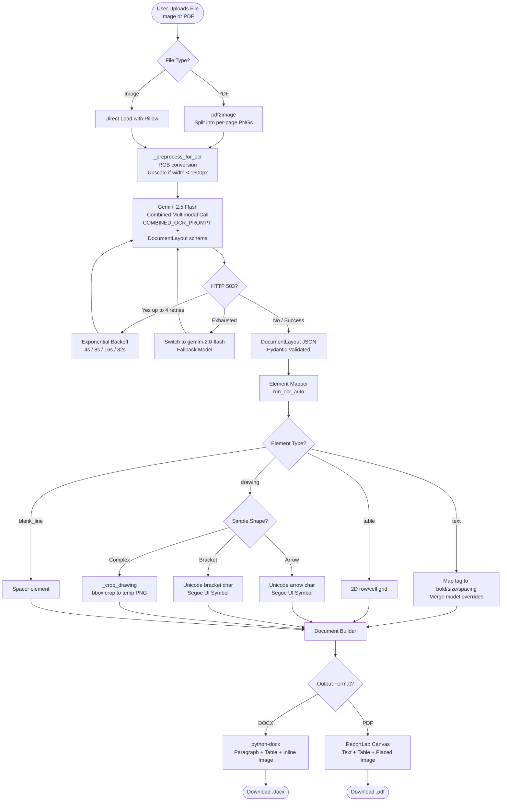

<div align="center">

# Docify AI

**High-fidelity handwriting-to-document conversion powered by Google Gemini**

[](https://www.python.org/)
[](https://fastapi.tiangolo.com/)
[](https://ai.google.dev/)
[](https://www.reportlab.com/)
[](https://python-docx.readthedocs.io/)
[](LICENSE)

Docify AI converts scanned handwritten notes, image photographs, and multi-page PDFs into structured, editable Microsoft Word (`.docx`) and PDF (`.pdf`) documents. It preserves the original layout, paragraph hierarchy, formatting styles, tables, and inline hand-drawn diagrams with surgical precision.

</div>

---

## Table of Contents

- [Overview](#overview)
- [Core Capabilities](#core-capabilities)
- [Technology Stack](#technology-stack)
- [System Architecture](#system-architecture)
  - [1. Image Preprocessing](#1-image-preprocessing)
  - [2. Consolidated Multimodal API Call](#2-consolidated-multimodal-api-call)
  - [3. Pydantic Schema Validation](#3-pydantic-schema-validation)
  - [4. Element Mapping and Document Assembly](#4-element-mapping-and-document-assembly)
  - [5. Resilience and Fallback Strategy](#5-resilience-and-fallback-strategy)
- [Document Element Types](#document-element-types)
- [Text Tag Classification](#text-tag-classification)
- [Directory Structure](#directory-structure)
- [Installation Guide](#installation-guide)
  - [Prerequisites](#prerequisites)
  - [Step-by-Step Setup](#step-by-step-setup)
- [Running the Application](#running-the-application)
- [Web Interface](#web-interface)
- [API Reference](#api-reference)
  - [POST /convert](#post-convert)
  - [GET /history](#get-history)
- [Configuration Reference](#configuration-reference)
- [Development Notes](#development-notes)
- [Known Limitations](#known-limitations)
- [License](#license)

---

## Overview

Traditional OCR engines produce flat, unformatted raw text strips that discard the document's visual hierarchy entirely. Docify AI takes a fundamentally different approach — it uses a single multimodal API call per page that simultaneously performs text transcription and spatial layout analysis.

The Gemini 2.5 Flash model analyzes the image holistically and returns a validated JSON object that describes every element in the document: its reading order position, content type, text formatting, table grid structure, or drawing bounding box. The backend then assembles the output document natively using these coordinates and formatting properties, producing output files that closely match the original handwritten layout.

---

## Core Capabilities

- **Consolidated OCR and Layout Analysis**: Text transcription and spatial layout detection happen in a single Gemini API request per page, reducing API consumption by 50% compared to two-pass systems.
- **Rich Text Formatting Reconstruction**: Headings, sub-headings, body text, bullet lists, centered lines, and underlined text are each assigned appropriate font sizes, weights, and paragraph spacing automatically.
- **Bold, Italic, and Underline Detection**: The model inspects character stroke weight, slant, and decorations independently per text element, overriding or blending with tag-level defaults.
- **Math and Equation Alignment**: Multi-line equations are parsed for the `=` operator position and padded with non-breaking spaces so vertical alignment is preserved in the output document.
- **Native Table Reconstruction**: Hand-drawn tables are extracted as structured 2D grids and inserted as native DOCX `Table Grid` cells or dynamically width-calculated ReportLab PDF rectangles.
- **Inline Diagram and Drawing Preservation**: Diagrams, flowcharts, and graphs are detected with normalized bounding boxes, cropped from the source image, and inserted inline at the exact reading-order position in both DOCX and PDF output.
- **Unicode Arrow and Bracket Rendering**: Simple single arrows and grouping brackets are converted directly to Segoe UI Symbol unicode characters rather than image files, producing clean, scalable glyphs.
- **Model Failover with Exponential Backoff**: On HTTP 503 / UNAVAILABLE errors, the system retries up to 4 times with exponential delays (4s, 8s, 16s, 32s), then automatically falls back to the `gemini-2.0-flash` model before raising an error.
- **Plain OCR Fallback**: If the structured JSON call fails entirely, a plain-text OCR pass is attempted using a simpler prompt and a prefix-based line parser, ensuring a result is always returned.
- **Auto-detect and Manual Override Modes**: Users can choose to let the model drive all formatting decisions, or manually select font family, font size, line spacing, text alignment, and page margins from the UI.

---

## Technology Stack

| Layer | Library / Service | Purpose |
| :--- | :--- | :--- |
| AI / Vision | `google-genai` v1.65+ (Gemini 2.5 Flash) | Multimodal OCR, layout analysis, structured JSON output |
| Web Framework | `FastAPI` | REST API endpoints and server-side page routing |
| ASGI Server | `uvicorn` | ASGI application server |
| Templating | `Jinja2` | HTML page rendering |
| Word Documents | `python-docx` | Paragraph, run, table, and image insertion into `.docx` |
| PDF Documents | `ReportLab` | Canvas-based text, table, and image rendering into `.pdf` |
| Image Processing | `Pillow` (PIL) | Image mode conversion, upscaling, cropping |
| PDF Input | `pdf2image` | Multi-page PDF to per-page PNG image conversion |
| Data Validation | `pydantic` v2 | JSON schema enforcement on Gemini responses |
| Environment | `python-dotenv` | Loading API credentials from `.env` |
| Frontend | HTML5, Vanilla CSS, Vanilla JavaScript | UI pages: landing, convert, history, about, login |

---

## System Architecture



### 1. Image Preprocessing

The function `_preprocess_for_ocr` normalizes input before passing it to Gemini:

- Converts any image mode (L, RGBA, P, CMYK) to standard `RGB`.
- Upscales images narrower than **1600 pixels** using `LANCZOS` high-quality resampling so fine handwriting details are preserved for the vision model.
- Deliberately avoids applying aggressive sharpening, contrast stretching, or binary thresholding — techniques that help traditional OCR engines but can destroy fine stroke variations that Gemini's multimodal encoder relies upon.

### 2. Consolidated Multimodal API Call

The `COMBINED_OCR_PROMPT` is a structured instruction set sent alongside the image in a single `client.models.generate_content` call. It instructs Gemini to:

- Transcribe all text with **100% fidelity** — preserving capitalization, abbreviations, math symbols, superscripts, and subscripts. Illegible words are replaced with `[?]`.
- Assign a semantic **tag** to each line (`HEADING`, `SUBHEAD`, `BODY`, `BULLET`, `CENTER`, `UNDERLN`).
- Detect **bold**, **italic**, and **underline** formatting independently per element.
- Estimate **left indentation** in centimeters (e.g., `0.5 cm` for bullet points).
- Identify **tables** and extract their cell content into 2D row-column arrays.
- Locate **drawings** and return normalized bounding boxes `[x1, y1, x2, y2]` as fractions of image dimensions.
- Classify simple drawings as arrows or brackets and provide directional/side metadata.
- Estimate overall **page margin** (in cm) and **line spacing** multiplier.
- Return elements in strict **top-to-bottom, left-to-right reading order**.

The call is configured at `temperature=0.1` for maximum OCR determinism:

```python
config = genai_types.GenerateContentConfig(
    response_mime_type="application/json",
    response_schema=DocumentLayout,
    temperature=0.1,
)
```

### 3. Pydantic Schema Validation

Gemini is constrained to produce a valid `DocumentLayout` JSON object by passing the Pydantic model as `response_schema`. This guarantees the response structure without any regex parsing:

```python
class DocElement(BaseModel):
    type: str          # 'text' | 'blank_line' | 'table' | 'drawing'
    text: Optional[str]
    tag: Optional[str] # 'HEADING' | 'SUBHEAD' | 'BODY' | 'BULLET' | 'CENTER' | 'UNDERLN'
    bold: Optional[bool]
    italic: Optional[bool]
    underline: Optional[bool]
    alignment: Optional[str]          # 'left' | 'center' | 'right' | 'justify'
    left_indent_cm: Optional[float]
    table_data: Optional[List[List[str]]]
    bbox: Optional[List[float]]       # [x1, y1, x2, y2] normalized 0.0–1.0
    description: Optional[str]
    is_simple_arrow: Optional[bool]
    arrow_direction: Optional[str]    # 'right' | 'left' | 'up' | 'down' | diagonals
    is_simple_bracket: Optional[bool]
    bracket_style: Optional[str]      # 'curly' | 'square' | 'plain'
    bracket_side: Optional[str]       # 'left' | 'right'

class DocumentLayout(BaseModel):
    page_margin_cm: float   # default: 2.54
    line_spacing: float     # 1.0 | 1.15 | 1.5 | 2.0
    elements: List[DocElement]
```

### 4. Element Mapping and Document Assembly

The `run_ocr_auto` function iterates the validated element list and maps each entry to an internal representation. Text elements blend tag-level defaults from `_PREFIX_MAP` with any model-level overrides the model detected (bold, italic, underline, alignment, indentation). This two-tier merge ensures maximum fidelity while maintaining consistent base formatting per tag type.

The prefix defaults are:

| Tag | Bold | Italic | Font Size | Alignment | Left Indent | Space Before | Space After |
| :--- | :---: | :---: | :---: | :--- | :---: | :---: | :---: |
| `HEADING` | Yes | No | 16 pt | left | 0.0 cm | 12 pt | 6 pt |
| `SUBHEAD` | Yes | No | 13 pt | left | 0.0 cm | 8 pt | 4 pt |
| `BODY` | No | No | 12 pt | left | 0.0 cm | 0 pt | 3 pt |
| `BULLET` | No | No | 12 pt | left | 0.5 cm | 0 pt | 3 pt |
| `CENTER` | No | No | 12 pt | center | 0.0 cm | 4 pt | 4 pt |
| `UNDERLN` | No | No | 12 pt | left | 0.0 cm | 0 pt | 3 pt |
| `TABLE` | No | No | 11 pt | left | 0.0 cm | 4 pt | 4 pt |

Drawings are handled by `_crop_drawing`, which applies the normalized bounding box to the original source image dimensions, crops the region, saves it as a temporary PNG, and then adds it inline (never floating) in the output document at the correct reading-order position.

### 5. Resilience and Fallback Strategy

The `_call_gemini` wrapper implements a layered resilience strategy:

1. **Primary model**: `gemini-2.5-flash` — up to 5 attempts with exponential backoff on 503.
2. **Fallback model**: `gemini-2.0-flash` — if the primary is still overloaded.
3. **Plain OCR fallback**: If the structured JSON call fails entirely, a plain-text OCR prompt is used and the resulting text is parsed line-by-line using the prefix-based `_parse_text_lines` function.
4. **Hard error fallback**: If all stages fail, a single error text element is inserted into the document so a file is always returned to the user.

---

## Document Element Types

| Type | Description |
| :--- | :--- |
| `text` | A single line or logical paragraph with formatting metadata. |
| `blank_line` | A vertical spacer between logical document sections. |
| `table` | A 2D grid of row/column cell text extracted from a hand-drawn table. |
| `drawing` | A diagram, flowchart, or sketch — embedded as a cropped image. |
| `arrow` | A simple directional arrow — rendered as a Segoe UI Symbol unicode character. |
| `bracket` | A grouping bracket or brace — rendered as a Segoe UI Symbol unicode character. |

---

## Text Tag Classification

| Tag | Description | Example |
| :--- | :--- | :--- |
| `HEADING` | Major document title, significantly larger or bolder than body text | `Chapter 3: Forces` |
| `SUBHEAD` | Section label, slightly bolder and larger than body, below a heading | `1.1 Newton's Laws` |
| `BODY` | Normal body paragraph text | `The formula is derived from...` |
| `BULLET` | Bulleted or numbered list item, visually indented | `- First law: inertia` |
| `CENTER` | Visually centered content such as a date, page number, or title | `June 2025` |
| `UNDERLN` | Text with a drawn underline directly beneath it | `Important Note` |

---

## Directory Structure

```
docify/
├── main.py                  # Application entry point — all backend logic
├── run.bat                  # Windows launcher script
├── .env                     # API key configuration (not committed to Git)
├── .gitignore               # Standard Git exclusions
├── static/
│   ├── css/
│   │   ├── styles.css       # Converter page and shared styles
│   │   └── landing.css      # Landing page styles
│   └── js/
│       ├── main.js          # Converter UI — upload, config, download
│       ├── main_v2.js       # Prototype split-screen editor (inactive)
│       ├── landing.js       # Landing page interactions
│       ├── about.js         # About page interactions
│       ├── history.js       # Conversion history list
│       ├── login.js         # Login page logic
│       └── theme.js         # Dark/light theme toggle
├── templates/
│   ├── landing.html         # Landing page
│   ├── index.html           # Converter interface
│   ├── about.html           # About page
│   ├── history.html         # Conversion history
│   └── login.html           # Login page
├── uploads/                 # Temporary storage for uploaded files (git-ignored)
└── outputs/                 # Generated .docx and .pdf files (git-ignored)
```

---

## Installation Guide

### Prerequisites

| Requirement | Notes |
| :--- | :--- |
| Python 3.9 or higher | Available at [python.org](https://www.python.org/downloads/) |
| pip | Included with Python 3.9+ |
| Poppler | Required by `pdf2image` for PDF page rendering |
| Google Gemini API Key | Obtain at [aistudio.google.com](https://aistudio.google.com) |

**Installing Poppler:**

- **Windows**: Download the latest [Poppler for Windows](https://github.com/oschwartz10612/poppler-windows/releases/) release. Extract the archive and add the `bin\` subdirectory to your system `PATH` environment variable.
- **macOS**: `brew install poppler`
- **Ubuntu / Debian**: `sudo apt-get install poppler-utils`

### Step-by-Step Setup

**1. Clone the repository:**

```bash
git clone https://github.com/meetchauhan17/docify.git
cd docify
```

**2. Create a virtual environment:**

```bash
python -m venv venv
```

**3. Activate the virtual environment:**

```bash
# Windows — PowerShell
.\venv\Scripts\Activate.ps1

# Windows — Command Prompt
.\venv\Scripts\activate.bat

# macOS / Linux
source venv/bin/activate
```

**4. Install all dependencies:**

```bash
pip install fastapi uvicorn python-docx reportlab pillow pdf2image google-genai pydantic python-dotenv jinja2 aiofiles
```

**5. Create the environment configuration file:**

Create a file named `.env` in the project root directory:

```env
GEMINI_API_KEY=your_google_gemini_api_key_here
```

> The `.env` file is listed in `.gitignore` and will never be committed to version control.

**6. Create required directories** (the application creates these automatically on startup, but you can create them manually):

```bash
mkdir uploads
mkdir outputs
```

---

## Running the Application

**Option A — Windows batch script:**

```batch
run.bat
```

**Option B — Direct uvicorn command:**

```bash
uvicorn main:app --reload --port 8000
```

Once the server is running, open your browser and navigate to:

```
http://localhost:8000
```

The `--reload` flag enables hot-reloading during development. Remove it in production.

---

## Web Interface

Docify AI exposes a multi-page web interface served by FastAPI with Jinja2 templating.

| Route | Page | Description |
| :--- | :--- | :--- |
| `/` | Landing | Project overview, feature highlights, call to action |
| `/convert` | Converter | File upload, format selection, formatting controls, download |
| `/history` | History | Log of previous conversion requests |
| `/about` | About | Technical details about the project |
| `/login` | Login | Authentication page (UI present, backend auth optional) |

---

## API Reference

### POST /convert

Converts an uploaded image or PDF into a Word or PDF document.

**Content-Type**: `multipart/form-data`

**Request Parameters:**

| Field | Type | Required | Default | Description |
| :--- | :--- | :---: | :--- | :--- |
| `file` | File | Yes | — | Source image (`PNG`, `JPG`, `JPEG`, `WEBP`) or multi-page `PDF`. |
| `mode` | String | No | `preserve` | `preserve` keeps original line breaks; `flow` joins lines into continuous paragraphs. |
| `outtype` | String | No | `docx` | Output file format: `docx` or `pdf`. |
| `auto_format` | String | No | `true` | `true` uses Gemini-detected layout; `false` uses manual override parameters below. |
| `font_family` | String | No | `Calibri` | Manual override font family (e.g., `Arial`, `Times New Roman`, `Georgia`). |
| `font_size` | Float | No | `12` | Manual override font size in points. |
| `line_spacing` | Float | No | `1.15` | Manual override line spacing multiplier (`1.0`, `1.15`, `1.5`, `2.0`). |
| `page_margin` | Float | No | `2.54` | Manual override page margin in centimeters (clamped between `1.0` and `5.0`). |
| `alignment` | String | No | `left` | Manual override text alignment: `left`, `center`, `right`, `justify`. |

**Response:**

On success, the server returns the generated file as a binary download with the appropriate `Content-Disposition` header (`attachment; filename="output.docx"` or `"output.pdf"`).

On failure, a JSON error response is returned:

```json
{
  "error": "Descriptive error message here"
}
```

**Example using curl:**

```bash
curl -X POST http://localhost:8000/convert \
  -F "file=@handwritten_notes.jpg" \
  -F "outtype=docx" \
  -F "auto_format=true" \
  --output result.docx
```

### GET /history

Returns the conversion history page (HTML). History is tracked client-side using browser `localStorage` in `static/js/history.js`.

---

## Configuration Reference

All runtime configuration is loaded from the `.env` file using `python-dotenv`.

| Variable | Required | Description |
| :--- | :---: | :--- |
| `GEMINI_API_KEY` | Yes | Your Google Gemini API key from Google AI Studio. |

**Internal constants (editable in `main.py`):**

| Constant | Default | Description |
| :--- | :--- | :--- |
| `_PRIMARY_MODEL` | `gemini-2.5-flash` | Primary Gemini model for all inference calls. |
| `_FALLBACK_MODEL` | `gemini-2.0-flash` | Fallback model on sustained 503 overload. |
| `UPLOAD_DIR` | `uploads/` | Temporary directory for incoming files and drawing crops. |
| `OUTPUT_DIR` | `outputs/` | Directory for completed output documents. |
| HTTP timeout | `120,000 ms` | Maximum time allowed per Gemini API call. |

---

## Development Notes

**Modifying the OCR prompt:**

The `COMBINED_OCR_PROMPT` string in `main.py` (lines 170–201) controls all transcription and layout analysis behavior. Changes here directly affect how Gemini interprets formatting, tables, and drawings.

**Extending the element schema:**

Add new fields to `DocElement` in `main.py` (lines 33–97) and update the prompt to instruct Gemini to populate those fields. Pydantic will validate all model output against the updated schema automatically.

**Adding new output formats:**

The document assembly is self-contained per format. DOCX is built in the `if outtype == "docx"` block using `python-docx`. PDF is built in the `elif outtype == "pdf"` block using ReportLab's canvas API. A new format (e.g., Markdown, HTML) can be added as an additional `elif` block.

**OCR post-processing:**

The `_OCR_FIXES` list (lines 310–321) contains compiled regex patterns that correct recurring Gemini OCR misreads, such as zero/O confusion in numeric contexts and markdown backtick leakage. Additional fixes can be appended to this list.

---

## Known Limitations

- **Handwriting recognition accuracy**: Accuracy is bounded by the quality and resolution of the input image. Very faint, smudged, or extremely small handwriting may result in partial transcription or `[?]` placeholders.
- **Complex multi-column layouts**: Documents with two or more side-by-side text columns may not be correctly serialized into a single reading order.
- **Very large PDFs**: Multi-page PDFs make one Gemini API call per page. Very large documents will produce proportional API costs and processing time.
- **PDF font embedding**: The PDF output uses ReportLab's built-in Helvetica font family. Custom fonts require additional ReportLab font registration.
- **Poppler dependency**: The PDF input pipeline depends on the Poppler utility being installed and available on the system PATH. Without it, PDF files cannot be processed.

---

## License

This project is licensed under the MIT License. See the [LICENSE](LICENSE) file for the full license text.
